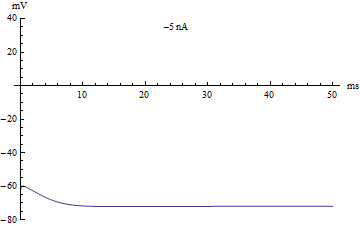

# Simulation of the Hodkin-Huxley model

The project is based on the following articles:

* [Hodkin-Huxley model](https://en.wikipedia.org/wiki/Hodgkin%E2%80%93Huxley_model)

## Introduction

### Lipid Bilayer
Each cell in the body is incased in a thin polar membrane called the [*Lipid bilayer*](https://en.wikipedia.org/wiki/Lipid_bilayer). In the Hodkin-Huxley model, this is modeled as the capacitance: $$C_m [\text{F}]$$
The equation for the current through the lipid bilayer is given by: 
$$
I_m = C_m \frac{d V_m}{dt} \quad \text{(m denotes 'membrane')}
$$

### Voltage-gated ion channels
In excitable cells (such as in nervonal and muscle tissue) you crucially find [*Voltage-gated ion channels*](https://en.wikipedia.org/wiki/Voltage-gated_ion_channel). These make it possible for rapid and co-ordinated [*depolarization*](https://en.wikipedia.org/wiki/Depolarization). Depolarization is when there is a shift in the electric charge distrubution within a cell, where the inside becomes more positively charged compared to the outside. This is illustrated in the following image. 

The voltage-gated ion channels are ion-specific, s.t. it only lets certain ions pass through, like ${\text{Na}}^+$, ${\text{K}}^+$, ${\text{Ca}}^{2+}$ and ${\text{Cl}}^-$. Whenever the potential difference over the lipid bilayer is high enough, the protein gets distorted the point where the gate opens, and ions flow through to depolarize, and equalize the potential. The electrical conductance through a channel n at a given time and voltage, is given as: 
$$g_i [1/Ω] \quad \text{(i: specific ion channel)}$$
The current through a given ion channel is given by:
$$I_i = g_i (V_m - V_i) \quad (V_i: \text{Reversal potential})$$
